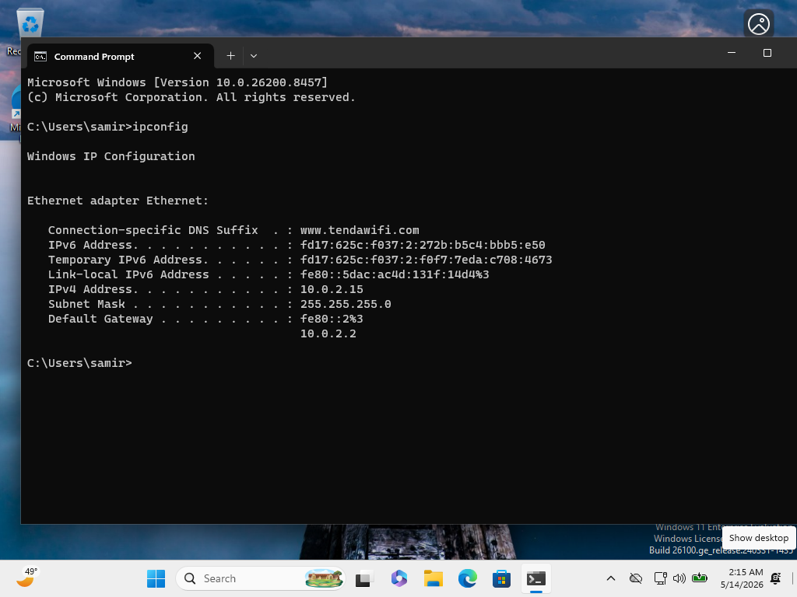
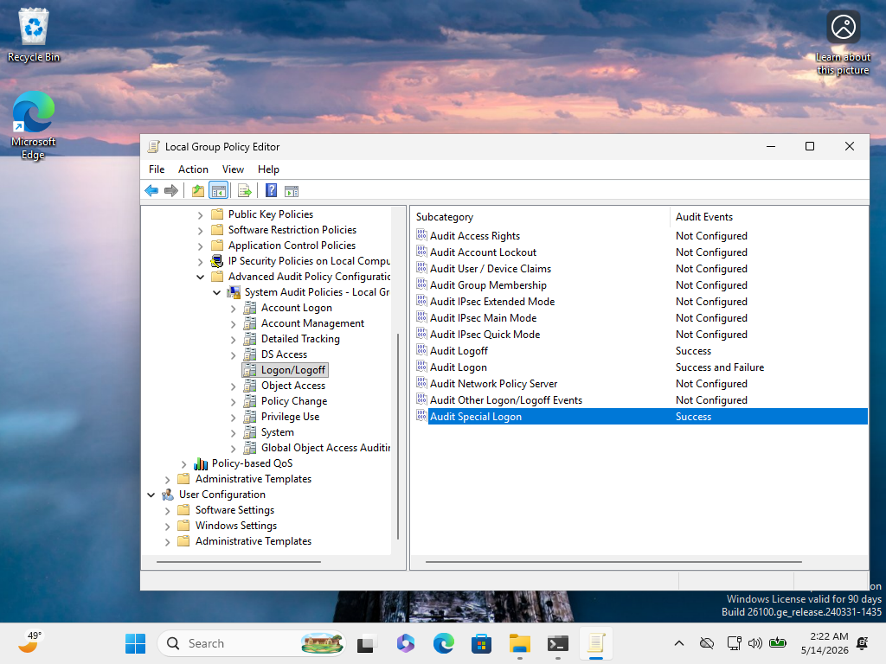
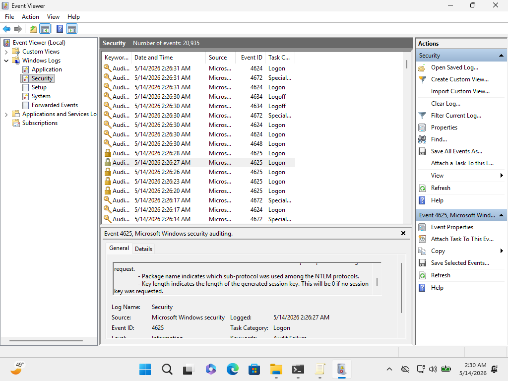
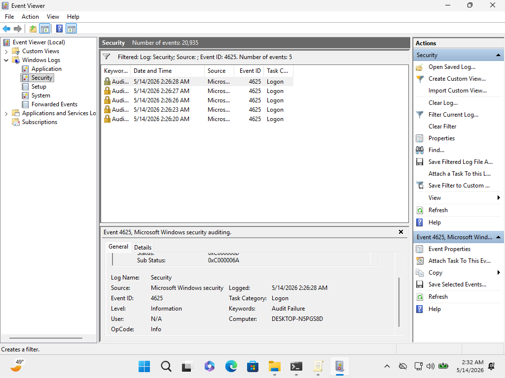

# Windows Security Event Analysis and Incident Investigation

## Project Description

This project focuses on Windows endpoint security monitoring and incident investigation using native Windows logging and auditing tools.

A Windows 11 Enterprise virtual machine was configured inside VirtualBox to generate and record authentication-related events, including both successful and failed login attempts.

Windows auditing policies were configured through Group Policy Editor to enable monitoring of Logon/Logoff activity.

The collected security logs were analyzed using Event Viewer to identify security-relevant events such as:

- Event ID 4624 (Successful Logon)
- Event ID 4625 (Failed Logon)
- Event ID 4672 (Special Privileges Assigned)

The project simulates basic SOC-style investigation workflows by detecting and interpreting suspicious authentication activity on a Windows endpoint.

---

## Tools Used

- Windows 11 Enterprise
- VirtualBox
- Event Viewer
- Group Policy Editor
- Command Prompt

---

## Windows Security Monitoring Lab

### 1. Windows 11 Virtual Machine Network Configuration

This screenshot shows the Windows 11 Enterprise virtual machine running inside VirtualBox with an active NAT network configuration.

The Command Prompt displays the assigned IP address, confirming that the system is properly connected and operational for security testing activities.

---

### 2. Windows Audit Policy Configuration

This screenshot shows the configuration of Windows security auditing policies using Group Policy Editor.

Logon/Logoff auditing is enabled to track both successful and failed authentication attempts.

---

### 3. Windows Security Event Logs

This screenshot shows Event Viewer displaying Security logs containing successful and failed authentication events.

The logs include:
- Event ID 4624 (Successful Logon)
- Event ID 4625 (Failed Logon)
- Event ID 4672 (Special Privileges Assigned)

These events provide the foundation for basic security monitoring and incident analysis.

---

### 4. Filtered Failed Authentication Events

This screenshot shows Event Viewer filtered to display only Event ID 4625 entries.

The filtered results highlight failed login attempts and demonstrate basic SOC-style investigation and authentication event analysis.

---

## Project Outcome

Successfully configured Windows auditing policies and analyzed authentication-related security events using Event Viewer.

The project demonstrates practical experience with Windows endpoint monitoring, event log analysis, audit policy configuration, and basic incident investigation workflows commonly used in SOC environments.
